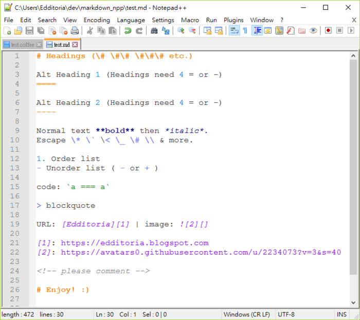

# 为Notepad++打造本地Markdown编辑环境

Notepad++ 是一套非常有特色的自由软件的纯文字编辑器,可以用来制作一般的纯文字说明文件，也十分适合当作撰写电脑程序的编辑器。

## Notepad++打造本地Markdown的方法：
#### 1.markdown语言包markdown-plus-plus

markdown-plus-plus 地址：https://github.com/Edditoria/markdown-plus-plus

#### 2.插件MarkdownViewerPlusPlus

Notepad++有一个插件，叫做 MarkdownViewer++，可以做到想看到所见即所得的效果

